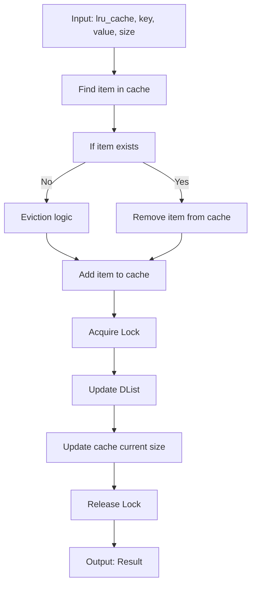
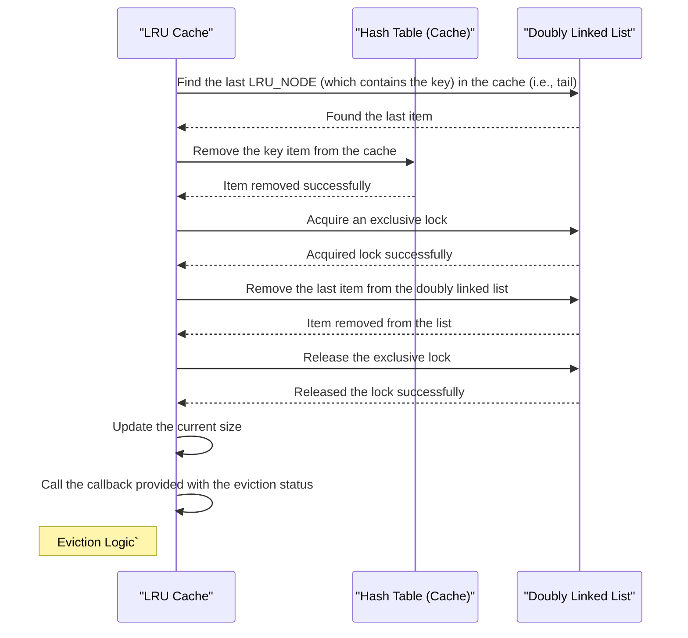
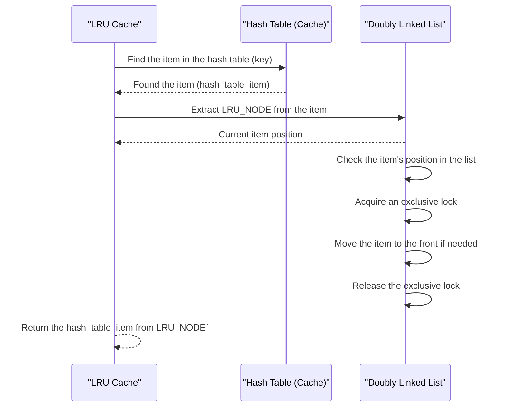

# LRU Cache Design

`lru_cache` is a module that implements a Least Recently Used (LRU) cache using `clds_hash_table` and `doubly_linked_list` from `c_util`.

The module provides the following functionality:

- Inserting items into the cache.
- Getting an item from the hash table by its key.
- Auto-eviction of items when the capacity is full.

All operations can be concurrent with other operations of the same or different kinds.

```c
typedef struct LRU_CACHE_TAG
{
    CLDS_HAZARD_POINTERS_HANDLE clds_hazard_pointers;
    CLDS_HAZARD_POINTERS_THREAD_HANDLE hazard_pointers_thread;
    CLDS_HASH_TABLE_HANDLE table;
    int64_t current_size;
    int64_t capacity;
    DWORD tls_slot;
    volatile_atomic int64_t* seq_no;
    DLIST_ENTRY head;
    SRW_LOCK_HANDLE lock;
} LRU_CACHE;

typedef struct LRU_NODE_TAG
{
    void* key;
    int64_t size;
    CLDS_HASH_TABLE_ITEM* value;
    DLIST_ENTRY node;
} LRU_NODE;

typedef void(*LRU_CACHE_EVICT_CALLBACK_FUNC)(void* context, LRU_CACHE_EVICT_RESULT cache_evict_status);
```

LRU Cache uses a `clds_hash_table`, a `srw_lock`, and a `doubly_linked_list`.

1. The table contains `LRU_NODE` instances as the value corresponding to the supplied keys. The `LRU_NODE` contains a `DLIST_ENTRY` which points to a node in the `doubly_linked_list`. A pointer to the `LRU_NODE` is stored in the `doubly_linked_list` as well.
2.  The `lock` is used to exclusively lock the `doubly_linked_list` while changing the order or removing the node from the list.

### Inserting Items into the Cache

The `lru_cache_put` function is used to insert or update an item in the cache. If the item already exists in the cache, it is removed and reinserted in the cache and moved to head position of `doubly_linked_list` to maintain the LRU order. If the cache is full, it performs eviction by removing the least recently used item until there is enough space for the new item.



### Eviction Logic

To evict the least recently used item from the cache, the key from the tail of the `doubly_linked_list` is removed from the `table`, and the node is removed from the `doubly_linked_list`. When an item gets evicted, the provided callback is triggered to report the eviction status. This is done in a loop until there is enough space in the cache.


### Getting Items from the Cache

This operation retrieves items from the cache and rearranges the order in the `doubly_linked_list` by moving the found item to its head. It ensures that recently accessed items are placed at the front of the list to maintain the LRU order.




### Scope for Improvements

- One area of improvement lies in the management of the `doubly_linked_list`, which is currently protected by a lock. To further optimize concurrent access to the cache, a lock-free `doubly_linked_list` can be used and remove `srw_lock` in its entirety. 


- Another potential enhancement involves moving `doubly_linked_list` updates to a background thread. Instead of immediately updating the list within cache operations like `get` we could use a queue for deferred processing. This approach enhances concurrency but may introduce race conditions between eviction and `doubly_linked_list` updates as the cache nears capacity. This might occasionally lead to extra waits during `put` operations, depending on whether the LRU cache must never exceed the capacity, or if it's acceptable to temporarily exceed (so puts can go ahead and the eviction will eventually catch up). (See this [comment](https://github.com/Azure/clds/pull/178#discussion_r1326092733) for more context)


- While `clds_singly_linked_list` handles insertions and deletions efficiently and lockless, evicting the 'tail' element can be relatively slow, as it requires traversing the list. One potential optimization is to offload this eviction process onto a separate thread. This could be done using `clds_singly_linked_list_find` with a callback that counts nodes until it reaches the desired eviction size and stores them in its `item_compare_context`. Once identified, these nodes can be efficiently removed, improving eviction performance. (See this [comment](https://github.com/Azure/clds/pull/178#discussion_r1326312429) for more context)
