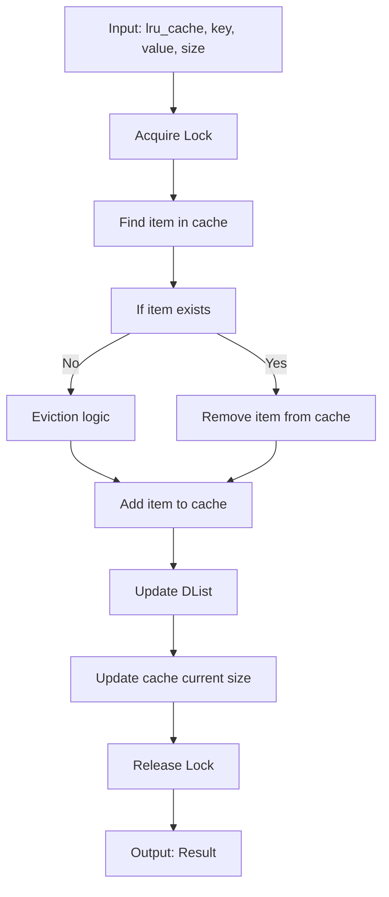
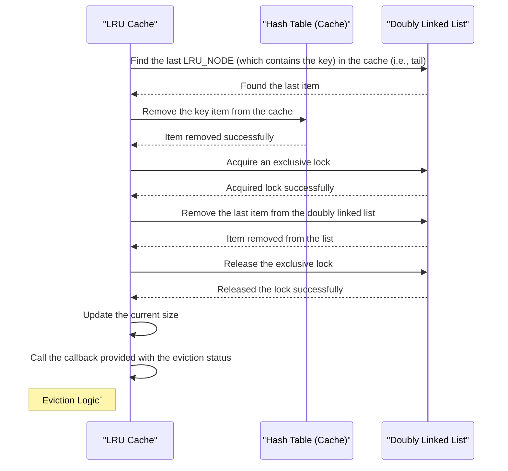
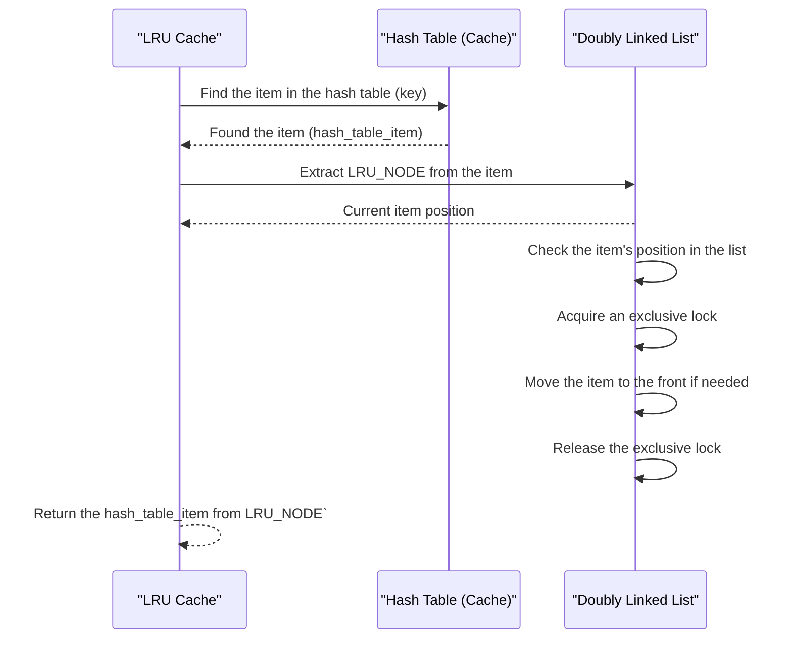

# LRU Cache Design

`lru_cache` is a module that implements a Least Recently Used (LRU) cache using `clds_hash_table` and `doubly_linked_list` from `c_util`.

The module provides the following functionality:

- Inserting items into the cache.
- Getting an item from the hash table by its key.
- Auto-eviction of items when the capacity is full.

All operations can be concurrent with other operations of the same or different kinds.

```c
typedef struct LRU_CACHE_TAG
{
    CLDS_HAZARD_POINTERS_HANDLE clds_hazard_pointers;
    CLDS_HAZARD_POINTERS_THREAD_HANDLE hazard_pointers_thread;
    CLDS_HASH_TABLE_HANDLE table;
    int64_t current_size;
    int64_t capacity;
    DWORD tls_slot;
    volatile_atomic int64_t* seq_no;
    DLIST_ENTRY head;
    SRW_LOCK_HANDLE lock;
} LRU_CACHE;

typedef struct LRU_NODE_TAG
{
    void* key;
    int64_t size;
    CLDS_HASH_TABLE_ITEM* value;
    DLIST_ENTRY node;
} LRU_NODE;

typedef void(*LRU_CACHE_EVICT_CALLBACK_FUNC)(void* context, LRU_CACHE_EVICT_RESULT cache_evict_status);
```

LRU Cache uses `clds_hash_tables`, a `srw_lock`, and a `doubly_linked_list`.

1.  The `table` stores the key and value `(void* key, CLDS_HASH_TABLE_ITEM* value)`. The `table` stores `DLIST_ENTRY` and `size` by crafting it in the form of `LRU_NODE` and storing this as a value in the form of `CLDS_HASH_TABLE_ITEM`.
2.  The `lock` is used to exclusively lock the `doubly_linked_list` while changing the order or removing the node from the list.

### Inserting Items into the Cache

The `lru_cache_put` function is used to insert or update an item in the cache. If the item already exists in the cache, it is removed and reinserted in the cache and moved to head position of `doubly_linked_list` to maintain the LRU order. If the cache is full, it performs eviction by removing the least recently used item until there is enough space for the new item.



### Eviction Logic

To evict the least recently used item from the cache, the key from the tail of the `doubly_linked_list` is removed from the `table`, and the node is truncated from the `doubly_linked_list`. When an item gets evicted, the provided callback is triggered to report the eviction status.


### Getting Items from the Cache

This operation retrieves items from the cache and rearranges the order in the `doubly_linked_list` by moving the found item to its head. It ensures that recently accessed items are placed at the front of the list to maintain the LRU order.




### Scope for Improvements

One area of improvement lies in the management of the `doubly_linked_list`, which is currently protected by a lock. To further optimize concurrent access to the cache, a lock-free `doubly_linked_list` can be used and remove `srw_lock` in its entirety. 

