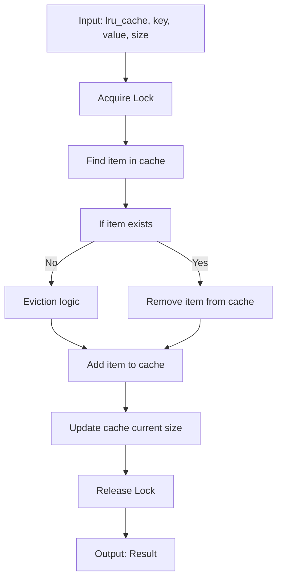
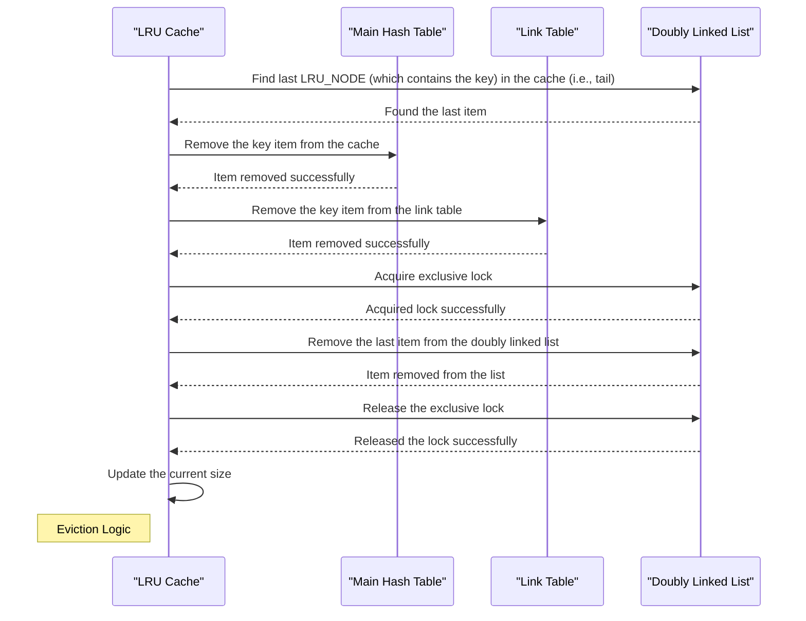
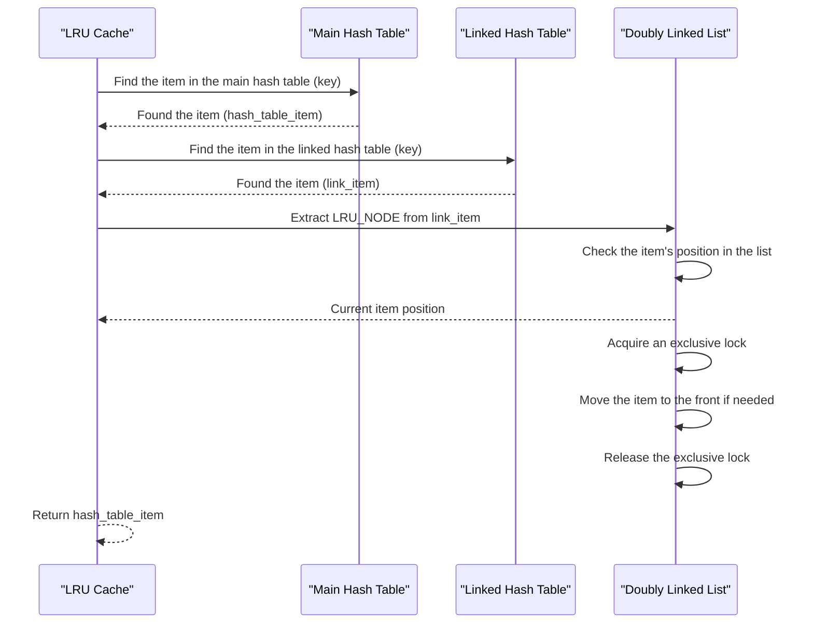

# LRU Cache Design

`lru_cache` is a module that implements a Least Recently Used (LRU) cache using `clds_hash_table` and `doublylinkedlist` from `c_util`.

The module provides the following functionality:

- Inserting items in the cache.
- Getting an item in the hash table by its key.
- Evicting the least recently used item and auto-eviction of items when capacity is full.

All operations can be concurrent with other operations of the same or different kinds.

```c
typedef struct LRU_CACHE_TAG
{
    CLDS_HAZARD_POINTERS_HANDLE clds_hazard_pointers;
    CLDS_HAZARD_POINTERS_THREAD_HANDLE hazard_pointers_thread;
    CLDS_HASH_TABLE_HANDLE item_table;
    CLDS_HASH_TABLE_HANDLE link_table;
    int64_t current_size;
    int64_t capacity;
    DWORD tls_slot;
    volatile_atomic int64_t* seq_no;
    DLIST_ENTRY head;
    SRW_LOCK_HANDLE lock;
} LRU_CACHE;

typedef struct LRU_NODE_TAG
{
    void* key;
    int64_t size;
    DLIST_ENTRY node;
} LRU_NODE;
```

LRU Cache uses 2 `clds_hash_tables`, a `srw_lock`, and a `doubly_linked_list`.
1. `item_table` stores the key and values `(void* key, CLDS_HASH_TABLE_ITEM* value)`.
2. `link_table` stores the key and `doubly_linked_list` node `(void* key, LRU_NODE value)`. This is used to quickly access the node and to maintain the LRU order.
3. `lock` is used to exclusively lock the `doubly_linked_list` while changing the order or removing the node from the list.

### Inserting items into the cache

The `lru_cache_put` function is used to insert or update an item in the cache. If the item already exists in the cache, it is removed and reinserted to maintain the LRU order. If the cache is full, it performs eviction by removing the least recently used item until there is enough space for the new item.



### Eviction

To evict the least recently used item from the cache, the key from the tail of the `doubly_linked_list` is removed in both the tables (i.e., `link_table` and `item_table`), and the node is truncated from the `doubly_linked_list`.



### Getting items from the cache

This operation retrieves items from the cache and rearranges the order in the `doubly_linked_list` by moving the found item to its head. It ensures that recently accessed items are placed at the front of the list to maintain the LRU order.


